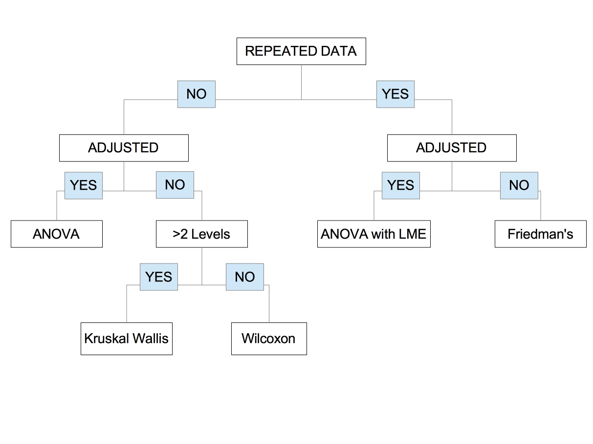

## Differential abundance testing using *DESeq2* and Analysis of Composition of Microbiomes (*ANCOM*)

This R Markdown document is part of a series used to analyze data and generate figures for the citation below. The current document includes all code and options used to run differential abundance testing referenced in the manuscript, using both `DESeq2` and `ANCOM 2.0`. These outputs are also provided as Supplementary Data files 3-8 and 11-24 with the citation below.  

### Title:
*Colonizing multidrug-resistant bacteria and the longitudinal evolution of the intestinal microbiome after liver transplantation*  

### Authors:
Medini K. Annavajhala, Angela Gomez-Simmonds, Nenad Macesic, Sean B. Sullivan, Anna Kress, Sabrina D. Khan, Marla J. Giddins, Stephania Stump, Grace I. Kim, Ryan Narain, Elizabeth C. Verna, Anne-Catrin Uhlemann  

### Journal: 
*Nature communications* **2019** 

```{r setup, include=FALSE}
knitr::opts_chunk$set(echo=TRUE, warning=FALSE, message=FALSE)

dir.create("differential_abundance")
```

### Load Required Libraries and Functions: 

```{r libraries}

library("phyloseq"); packageVersion("phyloseq")
library("DESeq2"); packageVersion("DESeq2")
library("exactRankTests"); packageVersion("exactRankTests")
library("nlme"); packageVersion("nlme")
library("dplyr"); packageVersion("dplyr")
library("reshape2"); packageVersion("reshape2")

source("inputs/ANCOM_updated_code.R", echo=F)

gm_mean = function(x, na.rm=TRUE){
  exp(sum(log(x[x > 0]), na.rm=na.rm) / length(x))
}

```

### Load data:

```{r import-data}

LT_data <- read.table("inputs/differential_abundance_metadata.txt", header=T)
colnames(LT_data) 

# Time_Category: One of 10 pre-selected sampling timepoints; pre-LT, then
#                   Weeks 1, 2, 3 and Months 1, 2, 3, 6, 9, and 12 post-LT
#
# Time_Category2: Timepoints split into 4 periods; pre-LT, peri-LT (Weeks 1-3),
#                   early post-LT (Months 1-3), late post-LT (Months 6-12)
#
# Primary_Diagnosis: primary underlying liver disease etiology (reason for LT)
#       AIH: Autoimmune hepatitis    
#       ARLD: Alcohol-related liver disease
#       BILIARY: Etiologies related to biliary complications
#       HBV: Hepatitis B virus
#       HCV: Hepatitis C virus
#       NAFLD: Non-alcoholic fatty liver disease
#       PCLD: Polycystic liver/kidney disease
#       OTHER
#
# ARLD: binary variable; yes/no for ARLD as the primary indication
#
# MELD2016_cat: above/below median MELD (18)
#
# CTP_Class: Standard definitions based on CTP score; A (5-6), B (7-9), C(10-13)
#
# ESBL_sample: binary (0=no; 1=yes) variable indicating whether the stool sample was 
#              culture-positive for Enterobacteriaceae resistant to third-generation 
#              cephalosporins and beta lactam/beta lactamase inhibitor combinations 
#              (Ceph-RE), sometimes referred to as ESBLs (extended-spectrum beta-lactam 
#              producers)
#
# CRE_sample: binary (0=no; 1=yes) variable indicating whether the stool sample was 
#             culture-positive for carbapenem-resistant Enterobacteriaceae (CRE)
#
# VRE_sample: binary (0=no; 1=yes) variable indicating whether the stool sample was 
#             culture-positive for vancomycin-resistant enterococci (VRE)
#
# MDRO_sample: binary (0=no; 1=yes) variable indicating whether the stool sample was 
#             culture-positive for CRE, VRE, and/or Ceph-RE 
#
# MDRO_within1yr: binary (0=no; 1=yes) variable indicating whether the patient associated 
#                 with the sample was culture-positive for CRE, VRE, and/or Ceph-RE at any 
#                 point up to 1-yr post-LT


# Read in phyloseq object (see Phyloseq_Objects.Rmd)
LT_phylo = readRDS("inputs/phylo_filtered.RDS")

df <- data.frame(sample_data(LT_phylo), 
                  "StoolID"=rownames(sample_data(LT_phylo))) #Sample names 
merged <- merge(df, LT_data, by="StoolID") #Merge metadata with phyloseq object
merged <- sample_data(merged)
sample_names(merged) = merged$StoolID #fix names
sample_data(LT_phylo) <- sample_data(merged)

```


#### `DESeq2`

First, we ran `DESeq2` to identify potentially differentially abundant taxa across several comparisons. 

##### Supplementary Data 3. Alcohol-related liver disease (ARLD) and pre-LT microbiota

Shannon $\alpha$-diversity was significantly lower in ARLD patients pre-LT than most other diagnoses (see Figure 2 and Table 2 in the manuscript). We wanted to see which taxa may be differentially abundance in these patients, contributing to their dysbiotic microbiome.


```{r deseq2-arld-preLT}

LT_pre = prune_samples(sample_data(LT_phylo)$Time_Category == "a-Pre", LT_phylo)
sample_data(LT_pre)$ARLD = factor(sample_data(LT_pre)$ARLD, levels=c("OTHER","ARLD"))
dds = phyloseq_to_deseq2(LT_pre, ~ARLD) # Here, we just look at ARLD as a binary variable
geoMeans = apply(counts(dds), 1, gm_mean) # Calculate geometric means
dds = estimateSizeFactors(dds, geoMeans = geoMeans)
dds = estimateDispersions(dds)
vst = getVarianceStabilizedData(dds)
deseq = DESeq(dds,fitType="local") # Run DESeq2
resultsNames(deseq) # Should show the comparison of interest (ARLD_vs_OTHER)
res_arld = results(deseq) 
res_arld = res_arld[order(res_arld$padj, na.last=NA),]
res_arld_tax = cbind(as(res_arld, "data.frame"), 
                     as(tax_table(LT_pre)[rownames(res_arld), ], 
                        "matrix")) # Merge in taxonomic information
alpha = 0.05 # Significant cut-off for FDR-adjusted p-value
sig_arld_tax = res_arld_tax[(res_arld_tax$padj<alpha),] 
head(sig_arld_tax)
write.table(sig_arld_tax,"differential_abundance/Supp_Data3.DESeq2_ARLD_preLT.txt", sep="\t")

```

We found `r nrow(sig_arld_tax)-1` differentially abundant taxa **pre-LT** in patients with vs. without ARLD.

##### Supplementary Data 5. MELD at LT and pre-LT microbiota

```{r deseq-meld-preLT}

sample_data(LT_pre)$MELD2016_cat = factor(sample_data(LT_pre)$MELD2016_cat, levels=c("LOW","HIGH"))
dds = phyloseq_to_deseq2(LT_pre, ~MELD2016_cat) # Here, we just look at meld as a binary variable
geoMeans = apply(counts(dds), 1, gm_mean) # Calculate geometric means
dds = estimateSizeFactors(dds, geoMeans = geoMeans)
dds = estimateDispersions(dds)
vst = getVarianceStabilizedData(dds)
deseq = DESeq(dds,fitType="local") # Run DESeq2
# resultsNames(deseq) 
res_meld = results(deseq) 
res_meld = res_meld[order(res_meld$padj, na.last=NA),]
res_meld_tax = cbind(as(res_meld, "data.frame"), 
                     as(tax_table(LT_pre)[rownames(res_meld), ], 
                        "matrix")) # Merge in taxonomic information
alpha = 0.05 # Significant cut-off for FDR-adjusted p-value
sig_meld_tax = res_meld_tax[(res_meld_tax$padj<alpha),] 
head(sig_meld_tax)
write.table(sig_meld_tax,"differential_abundance/Supp_Data5.DESeq2_MELD_preLT.txt", sep="\t")

```

##### Supplementary Data 7. CTP class at LT and pre-LT microbiota

```{r deseq-ctp-preLT}

sample_data(LT_pre)$CTP_Class = factor(sample_data(LT_pre)$CTP_Class, levels=c("A","B","C"))
dds = phyloseq_to_deseq2(LT_pre, ~CTP_Class) # Here, we just look at ctp as a binary variable
geoMeans = apply(counts(dds), 1, gm_mean) # Calculate geometric means
dds = estimateSizeFactors(dds, geoMeans = geoMeans)
dds = estimateDispersions(dds)
vst = getVarianceStabilizedData(dds)
deseq = DESeq(dds,fitType="local") # Run DESeq2
# resultsNames(deseq) # Should show the comparison of interest (C_vs_A)
res_ctp = results(deseq, contrast=c("CTP_Class","C","A")) 
res_ctp = res_ctp[order(res_ctp$padj, na.last=NA),]
res_ctp_tax = cbind(as(res_ctp, "data.frame"), 
                     as(tax_table(LT_pre)[rownames(res_ctp), ], 
                        "matrix")) # Merge in taxonomic information
alpha = 0.05 # Significant cut-off for FDR-adjusted p-value
sig_ctp_tax = res_ctp_tax[(res_ctp_tax$padj<alpha),] 
head(sig_ctp_tax)
write.table(sig_ctp_tax,"differential_abundance/Supp_Data7.DESeq2_CTP_CvA_preLT.txt", sep="\t")

```

##### Supplementary Data 11, 12, 13. Longitudinal changes in microbiota stratified by primary disease etiology

The next example is a little more complicated. We wanted to see which taxa were enriched at different phases of the study period (pre-LT, peri-LT, early post-LT, and late post-LT), while controlling for the primary underlying liver disease etiology. 

```{r deseq2-timecat-diagnosis}

LT_phylo_diags = prune_samples(sample_data(LT_phylo)$Primary_Diagnosis %in% 
                c("AIH","ARLD","BILIARY","HBV","HCV","NAFLD"), LT_phylo)
sample_data(LT_phylo_diags)$Time_Category2 = factor(sample_data(LT_phylo_diags)$Time_Category2)
sample_data(LT_phylo_diags)$Primary_Diagnosis = factor(sample_data(LT_phylo_diags)$Primary_Diagnosis)
dds = phyloseq_to_deseq2(LT_phylo_diags, 
                         ~ Time_Category2 + 
                           Primary_Diagnosis)
geoMeans = apply(counts(dds), 1, gm_mean)
dds = estimateSizeFactors(dds, geoMeans = geoMeans)
dds = estimateDispersions(dds)
vst = getVarianceStabilizedData(dds)
deseq = DESeq(dds, fitType="local")
resultsNames(deseq)

#First, peri- v pre-LT
res_peripre = results(deseq, 
                      contrast = c("Time_Category2","b-Peri","a-Pre")) 
res_peripre = res_peripre[order(res_peripre$padj, na.last=NA),]
res_peripre_tax = cbind(as(res_peripre, "data.frame"), 
                        as(tax_table(LT_phylo_diags)[rownames(res_peripre), ], 
                           "matrix"))
sig_peripre_tax = res_peripre_tax[(res_peripre_tax$padj<alpha),]
head(sig_peripre_tax)
write.table(sig_peripre_tax,"differential_abundance/Supp_Data11.DESeq2_peri_v_preLT.txt", sep="\t")

#Then, early post-LT vs peri-LT
res_earlypostperi = results(deseq, 
                      contrast = c("Time_Category2","c-Post_M1to3","b-Peri")) 
res_earlypostperi = res_earlypostperi[order(res_earlypostperi$padj, na.last=NA),]
res_earlypostperi_tax = cbind(as(res_earlypostperi, "data.frame"), 
                        as(tax_table(LT_phylo_diags)[rownames(res_earlypostperi), ], 
                           "matrix"))
sig_earlypostperi_tax = res_earlypostperi_tax[(res_earlypostperi_tax$padj<alpha),]
head(sig_earlypostperi_tax)
write.table(sig_earlypostperi_tax,"differential_abundance/Supp_Data12.DESeq2_earlypost_v_periLT.txt", sep="\t")

#Lastly, late vs early post-LT 
res_latevearlypostLT = results(deseq, 
                      contrast = c("Time_Category2","d-Post_M6to12","c-Post_M1to3")) 
res_latevearlypostLT = res_latevearlypostLT[order(res_latevearlypostLT$padj, na.last=NA),]
res_latevearlypostLT_tax = cbind(as(res_latevearlypostLT, "data.frame"), 
                        as(tax_table(LT_phylo_diags)[rownames(res_latevearlypostLT), ], 
                           "matrix"))
sig_latevearlypostLT_tax = res_latevearlypostLT_tax[(res_latevearlypostLT_tax$padj<alpha),]
head(sig_latevearlypostLT_tax)
write.table(sig_latevearlypostLT_tax,"differential_abundance/Supp_Data13.DESeq2_late_v_earlypostLT.txt", sep="\t")

```

For example, we found `r nrow(sig_peripre_tax)-1` differentially abundant taxa between peri-LT and pre-LT samples, controlling for liver disease.

##### Supplementary Data 15. Pre-LT microbiota differentially abundant in patients who develop MDRB colonization

We wanted to see which taxa may be differentially abundant **pre-LT** in  patients who develop multidrug-resistant bacterial (MDRB) colonization at any point up to 1 year post-LT.


```{r deseq2-mdro1yr-preLT}

sample_data(LT_pre)$MDRO_within1yr = factor(sample_data(LT_pre)$MDRO_within1yr)
dds = phyloseq_to_deseq2(LT_pre, ~MDRO_within1yr)
geoMeans = apply(counts(dds), 1, gm_mean) # Calculate geometric means
dds = estimateSizeFactors(dds, geoMeans = geoMeans)
dds = estimateDispersions(dds)
vst = getVarianceStabilizedData(dds)
deseq = DESeq(dds,fitType="local") # Run DESeq2
# resultsNames(deseq) # Should show the comparison of interest (1_vs_0)
res_mdro_1yr = results(deseq) 
res_mdro_1yr = res_mdro_1yr[order(res_mdro_1yr$padj, na.last=NA),]
res_mdro_1yr_tax = cbind(as(res_mdro_1yr, "data.frame"), 
                     as(tax_table(LT_pre)[rownames(res_mdro_1yr), ], 
                        "matrix")) # Merge in taxonomic information
alpha = 0.05 # Significant cut-off for FDR-adjusted p-value
sig_mdro_1yr_tax = res_mdro_1yr_tax[(res_mdro_1yr_tax$padj<alpha),] 
head(sig_mdro_1yr_tax)
write.table(sig_mdro_1yr_tax,"differential_abundance/Supp_Data15.DESeq2_preLT_MDRB_1yr.txt", sep="\t")

```

##### Supplementary Data 17, 19, 21, and 23. Microbiota differentially abundant in patients with colonizing CRE, Ceph-RE, VRE, and any MDRB (all time-points)

First, we wanted to see which taxa may be differentially abundant in patients during CRE colonization.


```{r deseq2-cre}

sample_data(LT_phylo)$CRE_sample = factor(sample_data(LT_phylo)$CRE_sample)
dds = phyloseq_to_deseq2(LT_phylo, ~CRE_sample)
geoMeans = apply(counts(dds), 1, gm_mean) # Calculate geometric means
dds = estimateSizeFactors(dds, geoMeans = geoMeans)
dds = estimateDispersions(dds)
vst = getVarianceStabilizedData(dds)
deseq = DESeq(dds,fitType="local") # Run DESeq2
# resultsNames(deseq) # Should show the comparison of interest (1_vs_0)
res_cre = results(deseq) 
res_cre = res_cre[order(res_cre$padj, na.last=NA),]
res_cre_tax = cbind(as(res_cre, "data.frame"), 
                     as(tax_table(LT_phylo)[rownames(res_cre), ], 
                        "matrix")) # Merge in taxonomic information
alpha = 0.05 # Significant cut-off for FDR-adjusted p-value
sig_cre_tax = res_cre_tax[(res_cre_tax$padj<alpha),] 
head(sig_cre_tax)
write.table(sig_cre_tax,"differential_abundance/Supp_Data17.DESeq2_CRE.txt", sep="\t")

```

Next, we wanted to identify differentially abundant taxa in patients during Ceph-RE colonization.


```{r deseq2-cephre}

sample_data(LT_phylo)$ESBL_sample = factor(sample_data(LT_phylo)$ESBL_sample)
dds = phyloseq_to_deseq2(LT_phylo, ~ESBL_sample)
geoMeans = apply(counts(dds), 1, gm_mean) # Calculate geometric means
dds = estimateSizeFactors(dds, geoMeans = geoMeans)
dds = estimateDispersions(dds)
vst = getVarianceStabilizedData(dds)
deseq = DESeq(dds,fitType="local") # Run DESeq2
# resultsNames(deseq) # Should show the comparison of interest (1_vs_0)
res_cephre = results(deseq) 
res_cephre = res_cephre[order(res_cephre$padj, na.last=NA),]
res_cephre_tax = cbind(as(res_cephre, "data.frame"), 
                     as(tax_table(LT_phylo)[rownames(res_cephre), ], 
                        "matrix")) # Merge in taxonomic information
alpha = 0.05 # Significant cut-off for FDR-adjusted p-value
sig_cephre_tax = res_cephre_tax[(res_cephre_tax$padj<alpha),] 
head(sig_cephre_tax)
write.table(sig_cephre_tax,"differential_abundance/Supp_Data19.DESeq2_CephRE.txt", sep="\t")

```

Then during VRE colonization.


```{r deseq2-vre}

sample_data(LT_phylo)$VRE_sample = factor(sample_data(LT_phylo)$VRE_sample)
dds = phyloseq_to_deseq2(LT_phylo, ~VRE_sample)
geoMeans = apply(counts(dds), 1, gm_mean) # Calculate geometric means
dds = estimateSizeFactors(dds, geoMeans = geoMeans)
dds = estimateDispersions(dds)
vst = getVarianceStabilizedData(dds)
deseq = DESeq(dds,fitType="local") # Run DESeq2
# resultsNames(deseq) # Should show the comparison of interest (1_vs_0)
res_vre = results(deseq) 
res_vre = res_vre[order(res_vre$padj, na.last=NA),]
res_vre_tax = cbind(as(res_vre, "data.frame"), 
                     as(tax_table(LT_phylo)[rownames(res_vre), ], 
                        "matrix")) # Merge in taxonomic information
alpha = 0.05 # Significant cut-off for FDR-adjusted p-value
sig_vre_tax = res_vre_tax[(res_vre_tax$padj<alpha),] 
head(sig_vre_tax)
write.table(sig_vre_tax,"differential_abundance/Supp_Data21.DESeq2_VRE.txt", sep="\t")

```

Lastly, during colonization with any MDRB (CRE, Ceph-RE, and/or VRE)

```{r deseq2-mdro}

sample_data(LT_phylo)$MDRO_sample = factor(sample_data(LT_phylo)$MDRO_sample)
dds = phyloseq_to_deseq2(LT_phylo, ~MDRO_sample)
geoMeans = apply(counts(dds), 1, gm_mean) # Calculate geometric means
dds = estimateSizeFactors(dds, geoMeans = geoMeans)
dds = estimateDispersions(dds)
vst = getVarianceStabilizedData(dds)
deseq = DESeq(dds,fitType="local") # Run DESeq2
# resultsNames(deseq) # Should show the comparison of interest (1_vs_0)
res_mdro = results(deseq) 
res_mdro = res_mdro[order(res_mdro$padj, na.last=NA),]
res_mdro_tax = cbind(as(res_mdro, "data.frame"), 
                     as(tax_table(LT_phylo)[rownames(res_mdro), ], 
                        "matrix")) # Merge in taxonomic information
alpha = 0.05 # Significant cut-off for FDR-adjusted p-value
sig_mdro_tax = res_mdro_tax[(res_mdro_tax$padj<alpha),] 
head(sig_mdro_tax)
write.table(sig_mdro_tax,"differential_abundance/Supp_Data23.DESeq2_MDRB.txt", sep="\t")

```

#### `ANCOM`

Due to the potential for high false-positive rates using `DESeq2` (Weiss et al., *Microbiome* **2017**), we also performed Analysis of Composition of Microbiomes (`ANCOM`) to refine our identification of bacterial taxa enriched in selected groups (Mandal et al., *Microb Ecol Health Dis* **2015**).

To figure out the appropriate parameters for our ANCOM analysis, we can look at the flowchart provided in the `ANCOM` manual. Big shout-out to my co-author Angela Gomez-Simmonds for repeatedly walking through this decision tree with me!



Below are the same analyses as shown for `DESeq2`, to highlight the difference between these methodologies.

##### Supplementary Data 4. Alcohol-related liver disease (ARLD) and pre-LT microbiota

Referring to the flowchart above, we know that since we are only looking at pre-LT samples this subset is not repeated data (only 1 sample per patient). Also, we first ran this analysis without adjusting for any covariates, as with the `DESeq2` above.

```{r ancom-arld-preLT}

otus = t(data.frame(otu_table(LT_phylo))) #transposed OTU table (rows are samples)
rownames(otus) = substr(rownames(otus), start=2, stop=6)
otus = data.frame(Sample.ID=rownames(otus), otus)

metadata = data.frame(sample_data(LT_phylo))
metadata$Sample.ID = metadata$StoolID
taxa <- data.frame(tax_table(LT_phylo))
taxa$OTUs = rownames(taxa)


metadata_preLT = metadata[which(metadata$Time_Category2=="a-Pre"),]
otus_preLT = otus[which(otus$Sample.ID %in% metadata_preLT$StoolID),]
metadata_preLT$Sample.ID = metadata_preLT$StoolID


comparison_test=ANCOM.main(OTUdat=otus_preLT,
                           Vardat=metadata_preLT,
                           adjusted=F, # Not adjusting for anything
                           repeated=F, # Not repeated data
                           main.var="ARLD",
                           adj.formula=NULL, # Not adjusting for anything
                           repeat.var=NULL, # Not repeated data
                           longitudinal=FALSE, # Just 1 timepoint
                           random.formula=NULL,
                           multcorr=2, # Taxa-based p-value correction (recommended)
                           sig=0.05, # $\alpha$ = 0.05
                           prev.cut=0.90) # Remove taxa absent from >=90% of samples

W.taxa.arld = comparison_test$W.taxa
W.taxa.arld$OTUs = substring(W.taxa.arld$otu.names,2)
W.taxa.arld.sig <- W.taxa.arld[which(W.taxa.arld$detected_0.6=="TRUE"),]
taxa.sig <- taxa[which(taxa$OTUs %in% W.taxa.arld.sig$OTUs),]
W.taxa.merged.arld <- merge(W.taxa.arld.sig, taxa, by="OTUs") #Merge results with taxonomic info

head(W.taxa.merged.arld)

write.table(W.taxa.merged.arld, "differential_abundance/Supp_Data4.ANCOM_ARLD_preLT.txt", sep="\t")

```


Multiple *Lactobacillus* spp. (including *L. zeae*) and *Streptococcus* spp. OTUs were differentially abundant in the ARLD group. This mostly aligns with the most differentially abundant OTUs identified by `DESeq2`.

##### Supplementary Data 6. MELD at LT and pre-LT microbiota

```{r ancom-meld-preLT}

metadata_preLT$MELD2016_cat = factor(metadata_preLT$MELD2016_cat, levels=c("LOW","HIGH"))

comparison_test=ANCOM.main(OTUdat=otus_preLT,
                           Vardat=metadata_preLT,
                           adjusted=F, # Not adjusting for anything
                           repeated=F, # Not repeated data
                           main.var="MELD2016_cat",
                           adj.formula=NULL, # Not adjusting for anything
                           repeat.var=NULL, # Not repeated data
                           longitudinal=FALSE, # Just 1 timepoint
                           random.formula=NULL,
                           multcorr=2, # Taxa-based p-value correction (recommended)
                           sig=0.05, # $\alpha$ = 0.05
                           prev.cut=0.90) # Remove taxa absent from >=90% of samples

W.taxa.meld = comparison_test$W.taxa
W.taxa.meld$OTUs = substring(W.taxa.meld$otu.names,2)
W.taxa.meld.sig <- W.taxa.meld[which(W.taxa.meld$detected_0.6=="TRUE"),]
taxa.sig <- taxa[which(taxa$OTUs %in% W.taxa.meld.sig$OTUs),]
W.taxa.merged.meld <- merge(W.taxa.meld.sig, taxa, by="OTUs") #Merge results with taxonomic info

head(W.taxa.merged.meld)

write.table(W.taxa.merged.meld, "differential_abundance/Supp_Data6.ANCOM_MELD_preLT.txt", sep="\t")

```

##### Supplementary Data 8. CTP class and pre-LT microbiota

```{r ancom-ctp-preLT}

metadata_preLT_CTP = metadata_preLT[(which(metadata_preLT$CTP_Class != "B")),]
metadata_preLT_CTP$CTP_Class = factor(metadata_preLT_CTP$CTP_Class, levels=c("A","C"))
otus_preLT_CTP = otus_preLT[(which(otus_preLT$Sample.ID %in% metadata_preLT_CTP$Sample.ID)),]


comparison_test=ANCOM.main(OTUdat=otus_preLT_CTP,
                           Vardat=metadata_preLT_CTP,
                           adjusted=F, # Not adjusting for anything
                           repeated=F, # Not repeated data
                           main.var="CTP_Class",
                           adj.formula=NULL, # Not adjusting for anything
                           repeat.var=NULL, # Not repeated data
                           longitudinal=FALSE, # Just 1 timepoint
                           random.formula=NULL,
                           multcorr=2, # Taxa-based p-value correction (recommended)
                           sig=0.05, # $\alpha$ = 0.05
                           prev.cut=0.90) # Remove taxa absent from >=90% of samples

W.taxa.ctp = comparison_test$W.taxa
W.taxa.ctp$OTUs = substring(W.taxa.ctp$otu.names,2)
W.taxa.ctp.sig <- W.taxa.ctp[which(W.taxa.ctp$detected_0.6=="TRUE"),]
taxa.sig <- taxa[which(taxa$OTUs %in% W.taxa.ctp.sig$OTUs),]
W.taxa.merged.ctp <- merge(W.taxa.ctp.sig, taxa, by="OTUs") #Merge results with taxonomic info

head(W.taxa.merged.ctp)

write.table(W.taxa.merged.ctp, "differential_abundance/Supp_Data8.ANCOM_CTP_CvA_preLT.txt", sep="\t")

```

##### Supplementary Data 14. Longitudinal changes in microbiota stratified by primary disease etiology

Unlike the prior examples, we are now adjusting for liver disease etiology as the major covariate (`adjusted=T`, `adj.formula="Primary_Diagnosis"`). This also represents longitudinal data, so we set `longitudinal=T` in the `ANCOM.main` function. Since there are multiple timepoints, we set `repeated=T`, but `repeat.var` to `NULL` since we are running an adjusted analysis (`repeat.var` is used for the Friedman's test). The random effects of StudyID (repeated measurements per patient) are taken account in the linear mixed-effect (LME) testing using `random.formula="~1|StudyID"`.

```{r ancom-timecat-diagnosis}

comparison_test=ANCOM.main(OTUdat=otus,
                           Vardat=metadata,
                           adjusted=T, 
                           repeated=T, 
                           main.var="Time_Category2",
                           adj.formula="Primary_Diagnosis", 
                           repeat.var=NULL, # see manual; only for Friedman's
                           longitudinal=T, 
                           random.formula="~1|StudyID",
                           multcorr=2, # Taxa-based p-value correction (recommended)
                           sig=0.05, # $\alpha$ = 0.05
                           prev.cut=0.90) # Remove taxa absent from >=90% of samples

W.taxa.timecat = comparison_test$W.taxa
W.taxa.timecat$OTUs = substring(W.taxa.timecat$otu.names,2)
W.taxa.timecat.sig <- W.taxa.timecat[which(W.taxa.timecat$detected_0.6=="TRUE"),]
taxa.sig <- taxa[which(taxa$OTUs %in% W.taxa.timecat.sig$OTUs),]
W.taxa.merged.timecat <- merge(W.taxa.timecat.sig, taxa, by="OTUs") #Merge results with taxonomic info

head(W.taxa.merged.timecat)

write.table(W.taxa.merged.timecat, "differential_abundance/Supp_Data14.ANCOM_timecategory.txt", sep="\t")

```

##### Supplementary Data 16. Pre-LT microbiota differentially abundant in patients who develop MDRB colonization

```{r ancom-mdro1yr-preLT}

metadata_preLT$MDRO_within1yr = factor(metadata_preLT$MDRO_within1yr)

comparison_test=ANCOM.main(OTUdat=otus_preLT,
                           Vardat=metadata_preLT,
                           adjusted=F, # Not adjusting for anything
                           repeated=F, # Not repeated data
                           main.var="MDRO_within1yr",
                           adj.formula=NULL, # Not adjusting for anything
                           repeat.var=NULL, # Not repeated data
                           longitudinal=FALSE, # Just 1 timepoint
                           random.formula=NULL,
                           multcorr=2, # Taxa-based p-value correction (recommended)
                           sig=0.05, # $\alpha$ = 0.05
                           prev.cut=0.90) # Remove taxa absent from >=90% of samples

W.taxa.mdro_1yr = comparison_test$W.taxa
W.taxa.mdro_1yr$OTUs = substring(W.taxa.mdro_1yr$otu.names,2)
W.taxa.mdro_1yr.sig <- W.taxa.mdro_1yr[which(W.taxa.mdro_1yr$detected_0.6=="TRUE"),]
taxa.sig <- taxa[which(taxa$OTUs %in% W.taxa.mdro_1yr.sig$OTUs),]
W.taxa.merged.mdro_1yr <- merge(W.taxa.mdro_1yr.sig, taxa, by="OTUs") #Merge results with taxonomic info

head(W.taxa.merged.mdro_1yr)

write.table(W.taxa.merged.mdro_1yr, "differential_abundance/Supp_Data16.ANCOM_MDRB_1yr_preLT.txt", sep="\t")

```

##### Supplementary Data 18, 20, 22, and 24. Microbiota differentially abundant in patients with colonizing CRE, Ceph-RE, VRE, and any MDRB (all time-points)

```{r ancom-cre}

metadata$CRE_sample = factor(metadata$CRE_sample)

comparison_test=ANCOM.main(OTUdat=otus,
                           Vardat=metadata,
                           adjusted=T, 
                           repeated=F, 
                           main.var="CRE_sample",
                           adj.formula="Time_Category2", 
                           repeat.var=NULL, 
                           longitudinal=F, 
                           random.formula="~1|StudyID",
                           multcorr=2, 
                           sig=0.05, 
                           prev.cut=0.90) 

W.taxa.cre = comparison_test$W.taxa
W.taxa.cre$OTUs = substring(W.taxa.cre$otu.names,2)
W.taxa.cre.sig <- W.taxa.cre[which(W.taxa.cre$detected_0.6=="TRUE"),]
taxa.sig <- taxa[which(taxa$OTUs %in% W.taxa.cre.sig$OTUs),]
W.taxa.merged.cre <- merge(W.taxa.cre.sig, taxa, by="OTUs") #Merge results with taxonomic info

head(W.taxa.merged.cre)

write.table(W.taxa.merged.cre, "differential_abundance/Supp_Data18.ANCOM_CRE.txt", sep="\t")

```

```{r ancom-cephre}

metadata$ESBL_sample = factor(metadata$ESBL_sample)

comparison_test=ANCOM.main(OTUdat=otus,
                           Vardat=metadata,
                           adjusted=T, 
                           repeated=F, 
                           main.var="ESBL_sample",
                           adj.formula="Time_Category2", 
                           repeat.var=NULL, 
                           longitudinal=F, 
                           random.formula="~1|StudyID",
                           multcorr=2, 
                           sig=0.05, 
                           prev.cut=0.90)

W.taxa.esbl = comparison_test$W.taxa
W.taxa.esbl$OTUs = substring(W.taxa.esbl$otu.names,2)
W.taxa.esbl.sig <- W.taxa.esbl[which(W.taxa.esbl$detected_0.6=="TRUE"),]
taxa.sig <- taxa[which(taxa$OTUs %in% W.taxa.esbl.sig$OTUs),]
W.taxa.merged.esbl <- merge(W.taxa.esbl.sig, taxa, by="OTUs") #Merge results with taxonomic info

head(W.taxa.merged.esbl)

write.table(W.taxa.merged.esbl, "differential_abundance/Supp_Data20.ANCOM_CephRE.txt", sep="\t")

```

```{r ancom-vre}

metadata$VRE_sample = factor(metadata$VRE_sample)

comparison_test=ANCOM.main(OTUdat=otus,
                           Vardat=metadata,
                           adjusted=T, 
                           repeated=F, 
                           main.var="VRE_sample",
                           adj.formula="Time_Category2", 
                           repeat.var=NULL, 
                           longitudinal=F, 
                           random.formula="~1|StudyID",
                           multcorr=2, 
                           sig=0.05, 
                           prev.cut=0.90)

W.taxa.vre = comparison_test$W.taxa
W.taxa.vre$OTUs = substring(W.taxa.vre$otu.names,2)
W.taxa.vre.sig <- W.taxa.vre[which(W.taxa.vre$detected_0.6=="TRUE"),]
taxa.sig <- taxa[which(taxa$OTUs %in% W.taxa.vre.sig$OTUs),]
W.taxa.merged.vre <- merge(W.taxa.vre.sig, taxa, by="OTUs") #Merge results with taxonomic info

head(W.taxa.merged.vre)

write.table(W.taxa.merged.vre, "differential_abundance/Supp_Data22.ANCOM_VRE.txt", sep="\t")

```

```{r ancom-mdro}

metadata$MDRO_sample = factor(metadata$MDRO_sample)

comparison_test=ANCOM.main(OTUdat=otus,
                           Vardat=metadata,
                           adjusted=T, 
                           repeated=F, 
                           main.var="MDRO_sample",
                           adj.formula="Time_Category2", 
                           repeat.var=NULL, 
                           longitudinal=F, 
                           random.formula="~1|StudyID",
                           multcorr=2, 
                           sig=0.05, 
                           prev.cut=0.90)

W.taxa.mdro = comparison_test$W.taxa
W.taxa.mdro$OTUs = substring(W.taxa.mdro$otu.names,2)
W.taxa.mdro.sig <- W.taxa.mdro[which(W.taxa.mdro$detected_0.6=="TRUE"),]
taxa.sig <- taxa[which(taxa$OTUs %in% W.taxa.mdro.sig$OTUs),]
W.taxa.merged.mdro <- merge(W.taxa.mdro.sig, taxa, by="OTUs") #Merge results with taxonomic info

head(W.taxa.merged.mdro)

write.table(W.taxa.merged.mdro, "differential_abundance/Supp_Data24.ANCOM_MDRB.txt", sep="\t")

```